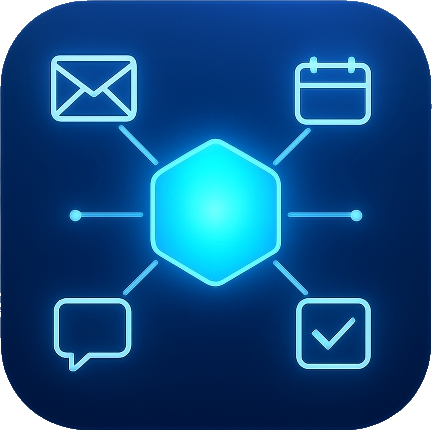

# AIA - AI-Powered Personal Productivity Assistant

<p align="center">
  
</p>

<p align="center">
  <strong>A modern, extensible WPF desktop application for intelligent task management, reminders, and productivity</strong>
</p>

<p align="center">
  <a href="#features">Features</a> •
  <a href="#installation">Installation</a> •
  <a href="#usage">Usage</a> •
  <a href="#ai-integration">AI Integration</a> •
  <a href="#plugin-system">Plugin System</a> •
  <a href="#development">Development</a>
</p>

---

## Overview

**AIA (AI Assistant)** is a comprehensive personal productivity application built with WPF (.NET 10) that combines intelligent task management, smart reminders, data organization, and AI-powered assistance in a sleek, modern interface. The application runs as an always-available overlay accessible via a global hotkey, featuring a powerful plugin system for extending functionality.

## Features

### ?? Task Management
- **Hierarchical Tasks**: Create tasks with unlimited subtask nesting
- **Multiple Statuses**: Not Started, In Progress, On Hold, Completed, Cancelled
- **Priority Levels**: Low, Medium, High, Critical with visual indicators
- **Due Dates**: Set deadlines with automatic overdue detection
- **Progress Tracking**: Visual progress indicators for tasks with subtasks
- **Notes & Descriptions**: Rich text fields for detailed task documentation

### ? Smart Reminders
- **Flexible Scheduling**: Set reminders for any date and time
- **Severity Levels**: Low, Medium, High, Urgent with color-coded indicators
- **Desktop Notifications**: Native Windows toast notifications with customizable duration
- **Snooze Functionality**: Quick snooze options (5, 10, 15, 30, 60 minutes)
- **Overdue Tracking**: Visual indicators and time-since-overdue display
- **Sound Alerts**: Optional audio notifications for critical reminders

### ??? Data Banks
- **Organized Categories**: Create custom categories with color coding
- **Multiple Entry Types**:
  - Text entries
  - Text files (.txt, .md, .json, etc.)
  - PDF documents
  - Images (PNG, JPG, BMP, GIF)
  - Email content
  - Custom formats
- **File Import**: Drag-and-drop or browse to import files
- **Tagging System**: Add searchable tags to entries
- **Preview Support**: Built-in preview for images and text content
- **Secure Storage**: Local file-based storage with organized folder structure

### ?? Screen Capture & Data Assets
- **Full Screen Capture**: Capture entire desktop
- **Active Window Capture**: Intelligent window tracking and capture
- **Recent Windows**: Automatically tracks last 3 active windows
- **Quick Save Options**:
  - Copy to clipboard
  - Save to file (PNG, JPEG, BMP)
  - Save directly to Data Bank
- **Thumbnail Generation**: Automatic thumbnail creation for previews

### ?? AI Chat Integration
- **Multi-Provider Support**:
  - OpenAI (GPT-4o, GPT-4, GPT-3.5 Turbo)
  - Azure OpenAI
  - Google Gemini (2.0 Flash, 1.5 Pro, 1.5 Flash)
  - Anthropic Claude (3.5 Sonnet, Opus, Sonnet, Haiku)
- **Intelligent Routing**: Automatic provider selection based on task type
- **Tool Integration**: AI can interact with tasks, reminders, and data banks
- **Context Awareness**: AI understands your current tasks and reminders
- **Conversation History**: Persistent chat sessions with rename/delete support
- **Streaming Responses**: Real-time response streaming for better UX

### ?? AI Tool Functions
The AI assistant can perform actions on your behalf:
- `get_tasks` - Retrieve and filter tasks
- `get_reminders` - Query upcoming reminders
- `get_databank_entries` - Search data bank content
- `create_task` - Create new tasks with details
- `create_reminder` - Set up new reminders
- `create_databank_entry` - Add content to data banks
- `get_app_summary` - Overview of all productivity data

### ??? Modern UI/UX
- **Fullscreen Overlay**: Quick-access overlay with smooth animations
- **System Tray Integration**: Runs in background with tray icon
- **Dark Theme**: Modern dark theme using WPF-UI library
- **Fluent Design**: Windows 11 Fluent Design System aesthetics
- **Keyboard Shortcuts**: Global hotkey support (customizable, default: Win+Q)
- **Responsive Layout**: Adaptive layout for different screen sizes

### ?? Plugin System
- **Modular Architecture**: Extend functionality through plugins
- **Plugin SDK**: Comprehensive SDK for building plugins
- **Permission System**: Granular permissions for plugin security
- **Built-in Plugins**:
  - **Outlook Integration**: Sync flagged emails as actionable items
  - **Teams Integration**: View meetings, messages, and join calls
- **Hot-Loading**: Load/unload plugins without restarting
- **Settings Integration**: Plugins can add their own settings panels

---

## System Requirements

- **Operating System**: Windows 10 (Build 22000+) or Windows 11
- **Runtime**: .NET 10.0 Runtime
- **Optional**: Microsoft Outlook (for Outlook plugin)
- **Optional**: Microsoft Teams (for Teams plugin)

---

## Installation

### Prerequisites

1. Install [.NET 10.0 Runtime](https://dotnet.microsoft.com/download/dotnet/10.0)

### From Source

```bash
# Clone the repository
git clone https://github.com/ffredyk/AIA.git

# Navigate to the project directory
cd AIA

# Restore dependencies
dotnet restore

# Build the solution
dotnet build --configuration Release

# Run the application
dotnet run --project AIA.csproj
```

### Configuration

On first run, AIA creates the following directory structure:

```
[App Directory]/
??? ai-config/           # AI provider configurations
?   ??? providers.json   # API keys and provider settings
?   ??? settings.json    # AI behavior settings
??? databanks/           # Data bank storage
?   ??? files/           # Imported files
?   ??? metadata.json    # Categories and entries
??? screenshots/         # Saved screen captures
??? backups/             # Application backups
??? tasks.json           # Task data
??? reminders.json       # Reminder data
??? chats.json           # Chat history
??? Plugins/             # Plugin assemblies
    ??? Outlook/
    ??? Teams/
```

---

## Usage

### Launching the Application

1. **First Launch**: Run AIA.exe - the application will minimize to the system tray
2. **Access Overlay**: Press `Win+Q` (or your custom hotkey) to show the overlay
3. **System Tray**: Double-click the tray icon to show the overlay

### Keyboard Shortcuts

| Shortcut | Action |
|----------|--------|
| `Win+Q` | Toggle overlay (customizable) |
| `Escape` | Close overlay |
| `Ctrl+N` | New task |
| `Ctrl+R` | New reminder |

### Managing Tasks

1. Click the **?** button or press `Ctrl+N` to add a new task
2. Click on a task to view/edit details
3. Use the status dropdown to track progress
4. Add subtasks by clicking "Add Subtask" in the task details
5. Set due dates and priority levels as needed

### Managing Reminders

1. Click **New Reminder** in the toolbar
2. Set the title, date/time, and severity
3. Reminders appear as desktop notifications when due
4. Click **View** on notifications to jump to the reminder
5. Use **Snooze** to delay reminders

### Using Data Banks

1. Navigate to the **Data Banks** tab
2. Create a category using the **+** button
3. Add entries by:
   - Clicking **+ New Entry** for text content
   - Clicking **Import File** to add files
   - Using **Save to Data Bank** from screen captures
4. Click an entry to view/edit its content

### AI Chat

1. Navigate to the **Chat** tab
2. Configure an AI provider in **Settings ? Orchestration**
3. Type your message and press Enter or click Send
4. The AI can:
   - Answer questions about your tasks/reminders
   - Create new tasks and reminders on request
   - Summarize your productivity data
   - Help with general queries

---

## AI Integration

### Configuring AI Providers

1. Click the ?? **Orchestration** button in the toolbar
2. Click **Add Provider**
3. Select your provider type and enter:
   - **OpenAI**: API Key
   - **Azure OpenAI**: Endpoint, API Key, Deployment Name
   - **Google Gemini**: API Key
   - **Anthropic**: API Key
4. Select a model and click **Test** to verify
5. Set as default if desired

### Provider Routing

AIA can automatically route requests to the best provider:

| Category | Best Providers |
|----------|---------------|
| Coding | OpenAI GPT-4, Claude |
| Math | OpenAI GPT-4, Gemini Pro |
| Creative | Claude, GPT-4 |
| Analysis | GPT-4, Gemini Pro |
| Summarization | Claude, GPT-3.5 |
| Task Management | Any provider |

### AI Settings

Configure AI behavior in the Orchestration window:
- **Enable Auto Routing**: Automatically select best provider
- **Enable Tool Use**: Allow AI to interact with your data
- **Include Context**: Share tasks/reminders/data bank info with AI
- **Temperature**: Control response creativity (0.0 - 1.0)
- **Max Tokens**: Limit response length

---

## Plugin System

### Plugin Architecture

AIA uses a modular plugin system with full isolation:

```
Plugin Architecture
??? AIA.Plugins.SDK      # Core SDK assembly
?   ??? IPlugin          # Main plugin interface
?   ??? PluginBase       # Base implementation
?   ??? IPluginContext   # Runtime context
?   ??? Services/        # Host services interfaces
??? Plugins/
    ??? Outlook/         # Microsoft Outlook integration
    ??? Teams/           # Microsoft Teams integration
```

### Plugin Permissions

Plugins must declare required permissions:

| Permission | Description |
|------------|-------------|
| `ReadTasks` | Read task data |
| `WriteTasks` | Create/modify tasks |
| `ReadReminders` | Read reminder data |
| `WriteReminders` | Create/modify reminders |
| `ReadDataBanks` | Read data bank content |
| `WriteDataBanks` | Modify data banks |
| `ReadDataAssets` | Access screenshots |
| `WriteDataAssets` | Save screenshots |
| `ReadChats` | Read chat history |
| `WriteChats` | Modify chats |
| `Network` | HTTP/network access |
| `FileSystem` | File system access |
| `ComAutomation` | COM automation (Office) |
| `PluginServices` | Inter-plugin communication |

### Built-in Plugins

#### Outlook Integration (`AIA.Plugins.Outlook`)

Features:
- Syncs flagged emails from Microsoft Outlook
- Displays email list with sender, subject, and preview
- Mark flags as complete or clear them
- Click to open email in Outlook
- Configurable refresh interval

Requirements:
- Microsoft Outlook installed
- `ComAutomation` permission

#### Teams Integration (`AIA.Plugins.Teams`)

Features:
- View today's meetings from calendar
- Display unread Teams messages
- Join meetings directly from AIA
- Click to open Teams chats
- Meeting time countdown

Requirements:
- Microsoft Teams / Outlook Calendar
- Optional: Microsoft Graph API configuration
- `ComAutomation`, `Network` permissions

### Creating a Plugin

1. Create a new Class Library project
2. Reference `AIA.Plugins.SDK`
3. Implement the plugin:

```csharp
using AIA.Plugins.SDK;

[Plugin("MyCompany.MyPlugin", "My Plugin Name", IconSymbol = "Apps20")]
public class MyPlugin : PluginBase
{
    public override string Id => "MyCompany.MyPlugin";
    public override string Name => "My Plugin Name";
    public override string Description => "What my plugin does";
    public override Version Version => new Version(1, 0, 0);
    public override string Author => "Your Name";

    public override PluginPermissions RequiredPermissions =>
        PluginPermissions.ReadTasks | PluginPermissions.Network;

    protected override async Task OnInitializeAsync()
    {
        // Register tabs, toolbar buttons, etc.
        Context.UI.RegisterTab(new PluginTabDefinition
        {
            TabId = "my-tab",
            Title = "My Tab",
            IconSymbol = "Apps20",
            ViewModel = new MyTabViewModel()
        });
    }

    protected override async Task OnStartAsync()
    {
        // Start background operations
    }

    protected override async Task OnStopAsync()
    {
        // Stop background operations
    }
}
```

4. Build and copy DLL to the `Plugins` folder
5. Restart AIA to load the plugin

### Plugin Services

Plugins can access host services through `IPluginContext`:

```csharp
// Access tasks
var tasks = Context.Tasks.GetAllTasks();
Context.Tasks.CreateTask("New Task", "Description");

// Access reminders
var reminders = Context.Reminders.GetAllReminders();
Context.Reminders.CreateReminder("Reminder", DateTime.Now.AddHours(1));

// Access data banks
var categories = Context.DataBanks.GetCategories();
Context.DataBanks.CreateEntry(categoryId, "Title", "Content");

// UI operations
Context.UI.ShowToast("Operation completed!", ToastType.Success);
Context.UI.RegisterToolbarButton(new PluginToolbarButton { ... });

// Logging
Context.Logger.Info("Plugin initialized");
Context.Logger.Error("An error occurred", exception);

// Settings
var value = Context.Settings.Get("SettingKey", defaultValue);
Context.Settings.Set("SettingKey", value);
await Context.Settings.SaveAsync();
```

---

## Development

### Project Structure

```
AIA/
??? AIA.csproj                    # Main application project
??? App.xaml(.cs)                 # Application entry point
??? MainWindow.xaml(.cs)          # Main overlay window
??? Models/
?   ??? OverlayViewModel.cs       # Main view model
?   ??? TaskItem.cs               # Task model
?   ??? ReminderItem.cs           # Reminder model
?   ??? ChatSession.cs            # Chat session model
?   ??? DataAsset.cs              # Screen capture model
?   ??? DataBankEntry.cs          # Data bank entry model
?   ??? AI/
?       ??? AIProvider.cs         # AI provider configuration
?       ??? AIModels.cs           # AI request/response models
??? Services/
?   ??? AppSettingsService.cs     # Settings management
?   ??? ChatSessionService.cs     # Chat persistence
?   ??? DataBankService.cs        # Data bank operations
?   ??? ScreenCaptureService.cs   # Screenshot functionality
?   ??? TaskReminderService.cs    # Task/reminder persistence
?   ??? AI/
?       ??? AIOrchestrationService.cs  # AI coordination
?       ??? AIProviderClients.cs       # Provider implementations
?       ??? AIToolsService.cs          # AI tool definitions
??? Views/
?   ??? ChatPanelView.xaml        # Chat interface
?   ??? TasksTabView.xaml         # Tasks tab
?   ??? RemindersTabView.xaml     # Reminders tab
?   ??? DataBanksTabView.xaml     # Data banks tab
?   ??? DataAssetsView.xaml       # Screen captures
?   ??? ToolbarView.xaml          # Toolbar
??? Plugins/
?   ??? SDK/                      # Plugin SDK project
?   ?   ??? IPlugin.cs
?   ?   ??? PluginBase.cs
?   ?   ??? IPluginContext.cs
?   ?   ??? Services/
?   ??? Host/                     # Plugin host implementation
?   ?   ??? PluginManager.cs
?   ?   ??? PluginLoader.cs
?   ?   ??? Services/
?   ??? Outlook/                  # Outlook plugin project
?   ??? Teams/                    # Teams plugin project
??? Resources/
?   ??? SharedStyles.xaml         # Common styles
?   ??? PluginTemplates.xaml      # Plugin UI templates
??? Icons/                        # Application icons
```

### Building

```bash
# Debug build
dotnet build

# Release build
dotnet build --configuration Release

# Build all projects
dotnet build AIA.sln
```

### Dependencies

| Package | Version | Purpose |
|---------|---------|---------|
| WPF-UI | 4.0.3 | Fluent UI components |
| System.Drawing.Common | 9.0.0 | Image processing |
| AIWrap | Custom | AI provider abstraction |

### Contributing

1. Fork the repository
2. Create a feature branch: `git checkout -b feature/my-feature`
3. Commit your changes: `git commit -am 'Add new feature'`
4. Push to the branch: `git push origin feature/my-feature`
5. Submit a pull request

### Code Style

- Follow C# coding conventions
- Use meaningful variable and method names
- Add XML documentation for public APIs
- Keep methods focused and concise
- Use async/await for I/O operations

---

## Data Storage

### Local Storage

All data is stored locally in the application directory:

- **Tasks**: `tasks.json` - JSON array of task objects
- **Reminders**: `reminders.json` - JSON array of reminder objects
- **Chats**: `chats.json` - JSON array of chat sessions
- **Data Banks**: `databanks/metadata.json` + files in `databanks/files/`
- **Settings**: `app-settings.json`, `plugin-settings.json`
- **AI Config**: `ai-config/providers.json`, `ai-config/settings.json`

### Backup & Restore

- **Auto Backup**: Configure automatic backups in Settings ? Data
- **Manual Backup**: Click "Backup Now" in Settings ? Data
- **Backup Location**: `[App Directory]/backups/`
- **Backup Format**: Timestamped ZIP files

---

## Settings

### Application Settings

| Setting | Description | Default |
|---------|-------------|---------|
| Run on Startup | Launch with Windows | Off |
| Overlay Shortcut | Global hotkey | Win+Q |
| Minimize to Tray | Close to tray | On |
| Check Updates | Auto-check for updates | On |
| Auto-Install Updates | Install without prompt | Off |

### Notification Settings

| Setting | Description | Default |
|---------|-------------|---------|
| Enable Notifications | Show desktop notifications | On |
| Warning Notifications | Notify before due | On |
| Warning Minutes | Minutes before warning | 30 |
| Urgent Notifications | Notify for urgent items | On |
| Urgent Minutes | Minutes for urgent state | 5 |
| Overdue Notifications | Notify when overdue | On |
| Play Sound | Audio notifications | Off |
| Duration | Notification display time | 10s |

### Plugin Settings

| Setting | Description | Default |
|---------|-------------|---------|
| Enable Plugins | Load plugins on startup | On |
| Check Plugin Updates | Auto-check for updates | On |
| Auto-Update Plugins | Install updates automatically | Off |

---

## Troubleshooting

### Common Issues

**Overlay not appearing**
- Check that the hotkey isn't conflicting with another application
- Try running as Administrator
- Verify the application is running (check system tray)

**AI not responding**
- Verify API key is correct in Orchestration settings
- Test the provider connection using the Test button
- Check internet connectivity
- Ensure the selected model is available in your API plan

**Outlook plugin not working**
- Ensure Microsoft Outlook is installed and configured
- Grant COM Automation permission to the plugin
- Try refreshing in the Outlook tab

**Teams plugin showing sample data**
- Configure Microsoft Graph API credentials in Teams settings
- Ensure proper permissions are granted in Azure AD

### Logs

Check the Output window in Visual Studio during development, or:
- Debug output is written to `System.Diagnostics.Debug`
- Plugin errors are logged through `IPluginLogger`

---

## License

This project is open source. See the [LICENSE](LICENSE) file for details.

---

## Acknowledgments

- [WPF-UI](https://github.com/lepoco/wpfui) - Fluent Design System for WPF
- [Fluent System Icons](https://github.com/microsoft/fluentui-system-icons) - Icon pack

---

## Contact

- **GitHub**: [@ffredyk](https://github.com/ffredyk)
- **Repository**: [https://github.com/ffredyk/AIA](https://github.com/ffredyk/AIA)

---

<p align="center">
  Made with ?? for productivity enthusiasts
</p>